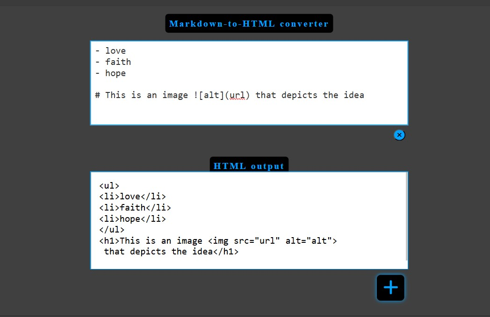

# Markdown to HTML converter.

**_Purpose:_** To take plain markdown that humans can write easily given the domain rules, and convert to HTML, that can be easily rendered by browsers.

**_Program Organization_**: Regex-based pipeline parser with minimal state machine, designed for simplicity and learning. It has known limitations in nesting which its refactored phase will later address using a stack. Overall, it works for 80% use cases.

## Three levels of software design...

- _Architectural design_
  - _Pattern_: Pipeline with state machine.
  - _Components_: Input validator, line splitter using blank line as delimiter, block parser, inline parser, HTML escaper for dangerous characters.
  - _Data flow_: String -> Array of lines written in markdown -> Array of lines in HTML -> String.
  - _Feasibility_: Handles 80% of mardown; nesting limitations will be solved in the refactored solution.

- _High-level design_
  - _mardownToHTML()_: Public API, the main orchestrator for the block parsing, state transformations and error processing.
  - _parseInLine()_: transforms at the inline-level,(images, links, bold, italic, code). Recursive in nature.
  - _escapeHTML()_: To prevent XSS, dangerous characters([&<>"']) are rendered as HTML entities in the HTML output.
  - _flushParagraph()_: Changes the paragraphBuffer state by clearing it and closing the paragraph. Every paragraph gets pushed as an element to the output list because the lines are first accumulated through a buffer.
  - _flushList()_: This closes any open list.

- _Detailed design_
  - _State variables_: These compose the soul of this project. currentListType, paragraghBuffer and inCodeBlock.
  - _Block detection_: Regex patterns are used to determine the kind of block we're in.
  - _Inline parsing_: Here, Order is destiny. Images first, followed by links, then bold, italic and code. This is because of the way they are written in markdown. Order ensures we move from broader specifics to narrower specifics. Like  must come before  and \*_ before _
  - _Error processing_: TypeError for invalid input and visual red border for empty submission in user interface.
  - _Indepth error processing:_ `if (typeof markdown !== "string") {
throw new TypeError("Input must be a string");
}` ensures we are building multiple layers of security/validation due to library usage by external callers outside of controlled UI environment. Textarea in the UI environment already ensures we get a string all the time. So this is defense in depth.
  - _Security_: escapeHTML() sanitizes &<>"' in a single pass to prevent XSS.
  - _Resource management and memory optimization_: After coming to the end of the paragraph, we clear the buffer by assigning it's length as 0 and that memory is reused again for the next paragraph.
  - _Change strategy_: The modular functions allow for ease of refactoring.
